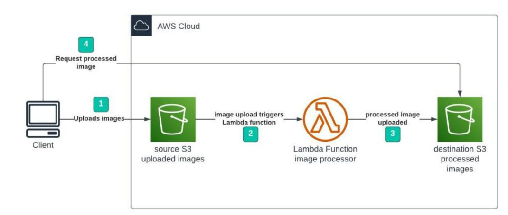

# Serverless Image Processing with S3 and Lambda

## Overview
This project demonstrates a **serverless image processing pipeline** on AWS using **S3 buckets** and an **AWS Lambda function**.  
When a client uploads an image to a source S3 bucket, a Lambda function is triggered to process the image and upload the result to a destination S3 bucket. Clients can then request the processed image.

---

## Architecture



**Workflow Steps:**

1. The client uploads an image to the **source S3 bucket** (`source-image-bucket`).
2. An **S3 event trigger** notifies a Lambda function of the new object.
3. The **Lambda function** processes the image (e.g., resize, watermark, convert format) and saves it to the **destination S3 bucket** (`processed-image-bucket`).
4. The client retrieves the processed image from the destination bucket.

---

## Prerequisites

- AWS Account  
- IAM user or role with permissions for:
  - S3 (read/write)  
  - Lambda (create, invoke)  
  - CloudWatch (logging)
- AWS CLI installed and configured
- Node.js / Python (depending on Lambda runtime)

---

## Deployment Steps

### 1️⃣ Create S3 Buckets
- Create a **source bucket** to upload original images.
- Create a **destination bucket** for processed images.

Example using AWS CLI:
```bash
aws s3 mb s3://source-image-bucket
aws s3 mb s3://processed-image-bucket
```

---

### 2️⃣ Write the Lambda Function
- Implement your image processing logic (e.g., using [Pillow](https://pillow.readthedocs.io/) for Python or [Sharp](https://sharp.pixelplumbing.com/) for Node.js).  
- Make sure your code:
  - Reads the image from the source bucket.
  - Processes it (resize, compress, etc.).
  - Writes the processed file to the destination bucket.

---

### 3️⃣ Package and Deploy the Lambda Function
- Zip the Lambda source code and dependencies:
```bash
zip -r lambda-package.zip .
```

- Create the Lambda function:
```bash
aws lambda create-function \
  --function-name imageProcessor \
  --runtime python3.10 \
  --role arn:aws:iam::<account-id>:role/<lambda-execution-role> \
  --handler lambda_function.lambda_handler \
  --zip-file fileb://lambda-package.zip
```

---

### 4️⃣ Configure S3 Trigger for Lambda
- Add an event notification to the source bucket:
  - Event type: `s3:ObjectCreated:*`
  - Destination: Lambda function

AWS CLI example:
```bash
aws s3api put-bucket-notification-configuration \
  --bucket source-image-bucket \
  --notification-configuration '{
    "LambdaFunctionConfigurations": [
      {
        "LambdaFunctionArn": "arn:aws:lambda:region:account-id:function:imageProcessor",
        "Events": ["s3:ObjectCreated:*"]
      }
    ]
  }'
```

---

### 5️⃣ Test the Workflow
- Upload an image to the source bucket:
```bash
aws s3 cp sample.jpg s3://source-image-bucket/
```

- Check the destination bucket for the processed image:
```bash
aws s3 ls s3://processed-image-bucket/
```

---

## Folder Structure
```
Manara-Cloud-Architecture/
│
├── lambda_function.py     # Lambda image processing code
├── requirements.txt       # Dependencies
├── README.md              # Project documentation
└── architecture.png       # Architecture diagram
```

---

## Logging and Monitoring
- Check execution logs in **CloudWatch Logs**.
- Monitor function metrics (invocations, errors, duration) in **CloudWatch Metrics**.

---

## Cleanup
To avoid unwanted charges:
1. Delete the Lambda function:
   ```bash
   aws lambda delete-function --function-name imageProcessor
   ```
2. Remove S3 buckets:
   ```bash
   aws s3 rb s3://source-image-bucket --force
   aws s3 rb s3://processed-image-bucket --force
   ```

